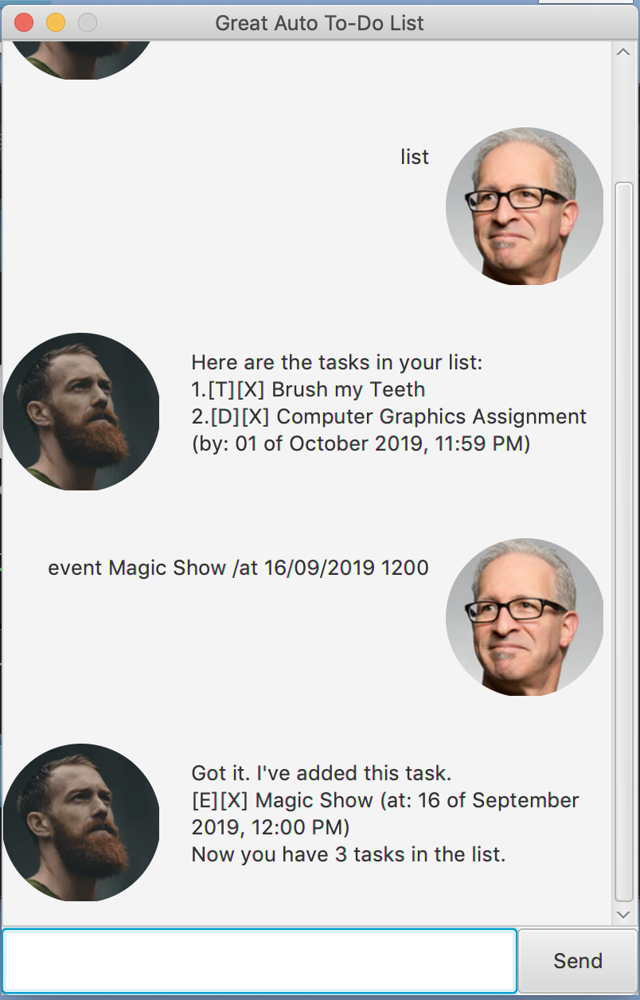

# User Guide
Welcome to Duke: The Great Auto To-Do List.
  Now you can never forget your tasks ever
again!

Complete the following set up before 
running this application in your computer.

## Prerequisites
1. Java SE Development Kit 11

## Feature
Here are some features that you can expect from the Great To-Do List.

### Feature 1: Add your Tasks into the To-Do List

You can add the following types of task.

1. ToDo Tasks: 
add ToDos by typing into the dialogue box `todo (insert description of task)` and then click Enter.
  
2. Deadlines: add Deadlines by typing into the dialogue box 
`deadline (insert description of tasks) /by (DD/MM/YYYY) (HHMM)`. 
 Take note that you must input the time of your deadline with reference to the 24-Hour Clock and then click Enter.  
3. Events: add Events by typing into the dialogue
box `event (insert description of tasks) /at (DD/MM/YYYY) (HHMM)`.
 Take note that you must input time of event with reference to the 24-Hour Clock and then click Enter.

### Feature 2: Deleting your Tasks

Delete tasks by inputting `delete (task_number_in_list)` in the given dialogue box.

### Feature 3: Find your Tasks 

Search for your tasks simply by typing in the words found in the tasks.

### Feature 4: List your Tasks

The Great To-Do List lists all your tasks by simply typing 

### Feature 5: Save your Tasks into a TextFile

The Great To-Do List allows you to save your tasks into a
text file. The text file is found in `{location of Great To-Do Lists}\data`.
  Your tasks can be found listed within the file `duke.txt`.

### Feature 6: Arrange Deadlines in order

Re-order your deadlines, starting with the deadlines that are earlier
than the others.

### Feature 7: Arrange Events in order

Re-order your events, starting with the events that are earlier 
than the others.

## Usage

Here are the commands you need to use the Great To-Do List.

### `bye` - Exit the Application.

Exit the To-Do List application by inputting this into the
dialogue box, then press Enter when prompted by the application.

Example of usage: 

`bye`

Expected outcome:

`Bye. Hope to see you again soon!`
 
`Press Enter to exit the chat!`
 
 Press Enter on keyboard to exit the application

### `deadline` - Creates a new Deadline.

Add deadline into the to-do list using the 
command `deadline INSERT_TASK_DESCRIPTION /by DD/MM/YYYY HHMM`.

Example of usage: 

`deadline Duke Assignment /by 15/09/2019 2000`

Expected outcome:

`Got it. I've added this task.` 
`[D][X] Duke Assignment 
(by: 15 September 2019, 08:00PM)` 
`Now you have 1 tasks in the list.`

### `delete` - Delete a Task.

Deletes a specified task using command `delete INDEX OF TASK`
and press Enter.

Example of usage:

`delete 2`

Expected outcome:

`Noted. I've removed this task:` 
Followed by the tasks that was in the list at index 6.

### `done` - Mark a Task as Done.

Mark an event as done using the command `done TASK_NUMBER IN 
LIST` and then click Enter.

Example of usage: 

`done 1`

Expected outcome:

`Nice! I've marked this task as done:` 
`[T][V] Eat Breakfast`

### `event` - Creates a new Event.

Add event into the event list with the command
`event INSERT_EVENT_DESCRIPTION /at DD/MM/YYYY HHMM` 
then click Enter.

Example of usage:

`event High Tea with President /at 13/09/2009 1800`

Expected outcome: 

`Got it. I've added this task.` 
`[E][X] High Tea with President 
(at: 13 September 2009, 06:00PM)` 
`Now you have 1 tasks in the list.`

### `find` - Find a Task with a specific Keyword.

Search for a task with a keyword using the command
`find KEYWORD`

Example of usage: 
`find breakfast`

Expected outcome:
`Here are the tasks in your list:` 
`1. [T][X] Eat Breakfast`

### `list` - Lists all Tasks in To-Do List.

List all the tasks in your to-do lists.

Example usage: 

`list`

Expected outcome:

`Here are the tasks in your list:` 
`1. [T][X] Eat Breakfast` 
`2. [T][V] Eat Supper`

### `todo` - Creates a new ToDo task.

Add todo task into the to-do list with the command
`todo INSERT_TASK_DESCRIPTION` then click Enter.

Example of usage:

`todo Clean the Floor`

Expected outcome:

`Got it. I've added this task.` 
`[T][X] Clean the Floor` 
`Now you have 1 tasks in the list.`

### `sort` - Sorts Deadline/Event in Chronological Order

Re-order either the deadlines or the events in chronological
order, starting with the earliest deadline/event.

Example of usage:

`sort deadline`

Expected outcome: 

`Here are the tasks in your list:` 
Followed by a list of all deadlines in ascending date
order. 
Note that these sorted tasks will now appear at the back
of your tasks list.
